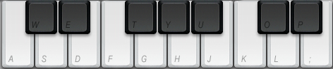
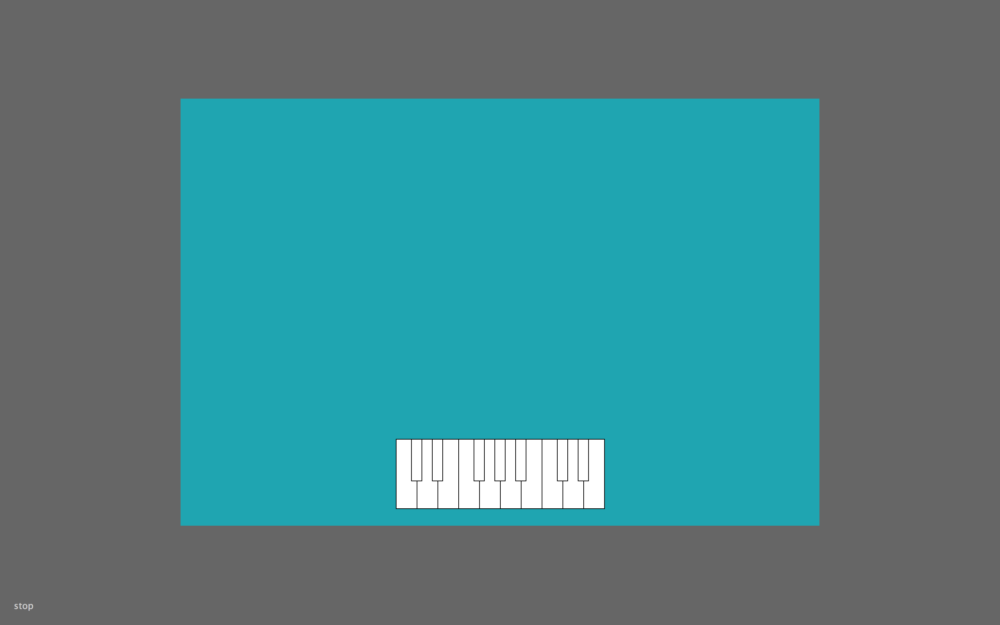
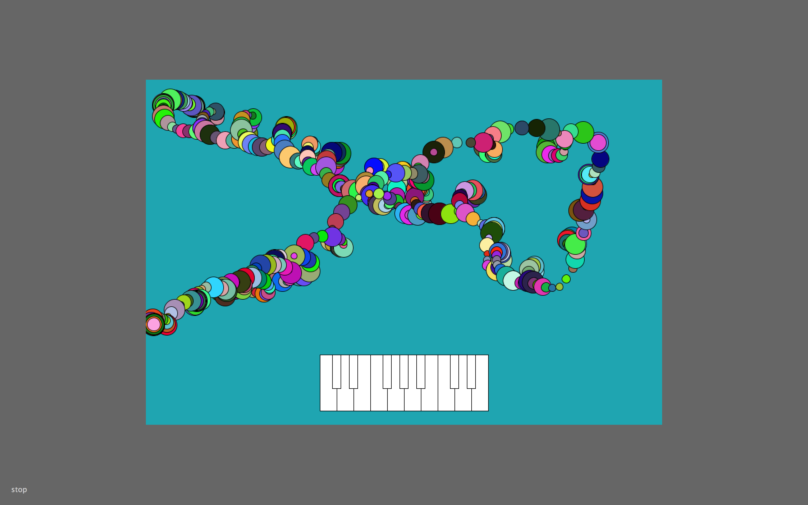
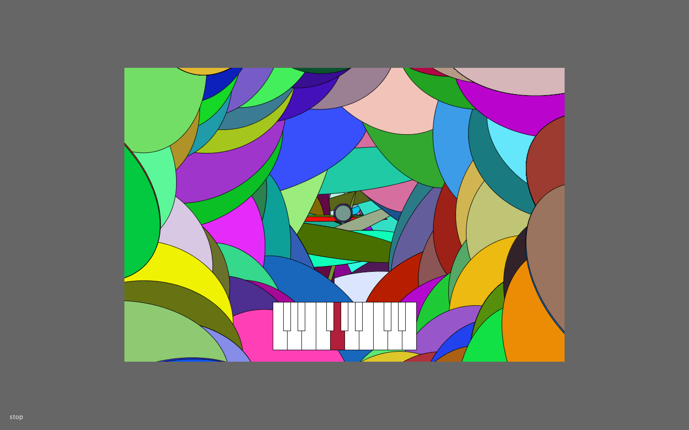

# _Modulation Synthesizer_

#### _Java program focused on Audio/Visual synthesis and modulation, 5/20/2016_

#### By _**Ryan Carlile, LaTaevia Berry, Joseph Arnstein, DJ Roychoudhury**_

## Description

_This application is meant to simulate a basic audio-frequency modulation synthesizer. The display has a keyboard for a visual representation of a synthesizer keyboard, as well as a simulated "Kaoss Pad" which manipulates the filter frequency when the modulator is activated. The Frequency Modulator can be activated by clicking the mouse. The on-screen synthesizer is mapped to the users keyboard._

_Processing is used for the IDE to visually and sonically code the synthesizer_

_"Processing is an open source programming language and integrated development environment (IDE) built for the electronic arts, new media art, and visual design communities with the purpose of teaching the fundamentals of computer programming in a visual context, and to serve as the foundation for electronic sketchbooks." [-wikipedia](https://en.wikipedia.org/wiki/Processing_(programming_language))_

_The beads audio library was used to build all of the audio objects. [-The Beads Project](http://www.beadsproject.net/)_

## Setup/Installation Requirements For the Web Application

* Clone this repository to your desktop, or desired directory.
* Open the terminal or command line in your computer and navigate to the directory the repository has been saved.
* enter `$ gradle run`.
* Open a new window or tab in your desired web browser.
* Enter the following in address bar: localhost:4567

## Setup/Installation Requirements For the SpottySynth Synthesizer
* Download the Processing IDE so that you can run the 'sketch' [-Get Processing](https://processing.org/download/)
* Once you have Processing 3 installed, open the program. It should start with a blank new file, or 'sketch'
* In the tool bar, navigate to Sketch>Import Library>Add Library
* Find the Beads Library and Install
* Copy the code from [SpottySynth.pde](https://raw.githubusercontent.com/droycho/EpiSynthPage/master/spottySynth/spottySynth.pde) and paste it to the blank 'sketch'.
* Press Play on the Processing Text Editor

## How To Use Spotty Synth
* Use your computers Keyboard to play notes
* Key Map:

* Click the mouse to activate the pen tool
* "Q" will clear the canvas
* "1" will add Psychedelic Ellipses

## Support and contact details

_Please report and issues or bugs in the Epicodus forums (http://forum.epicodus.com/top/all) or send us an email._

## Technologies Used

_Java, Velocity, Spark, JUnit, Bootstrap, CSS, Google Fonts, Gradle, Processing3_

## Support and contact details

_Please report and issues or bugs in the Epicodus forums (http://forum.epicodus.com/top/all) or send me an email._

## Technologies Used

_Java, Velocity, Spark, JUnit, Bootstrap, CSS, Google Fonts, Gradle_

### License

* MIT License

Copyright (c) [2016] [Ryan Carlile, LaTaevia Berry, Joseph Arnstein, DJ Roychoudhury]

Permission is hereby granted, free of charge, to any person obtaining a copy of this software and associated documentation files (the "Software"), to deal in the Software without restriction, including without limitation the rights to use, copy, modify, merge, publish, distribute, sublicense, and/or sell copies of the Software, and to permit persons to whom the Software is furnished to do so, subject to the following conditions:

The above copyright notice and this permission notice shall be included in all copies or substantial portions of the Software.

THE SOFTWARE IS PROVIDED "AS IS", WITHOUT WARRANTY OF ANY KIND, EXPRESS OR IMPLIED, INCLUDING BUT NOT LIMITED TO THE WARRANTIES OF MERCHANTABILITY, FITNESS FOR A PARTICULAR PURPOSE AND NONINFRINGEMENT. IN NO EVENT SHALL THE AUTHORS OR COPYRIGHT HOLDERS BE LIABLE FOR ANY CLAIM, DAMAGES OR OTHER LIABILITY, WHETHER IN AN ACTION OF CONTRACT, TORT OR OTHERWISE, ARISING FROM, OUT OF OR IN CONNECTION WITH THE SOFTWARE OR THE USE OR OTHER DEALINGS IN THE SOFTWARE.*
